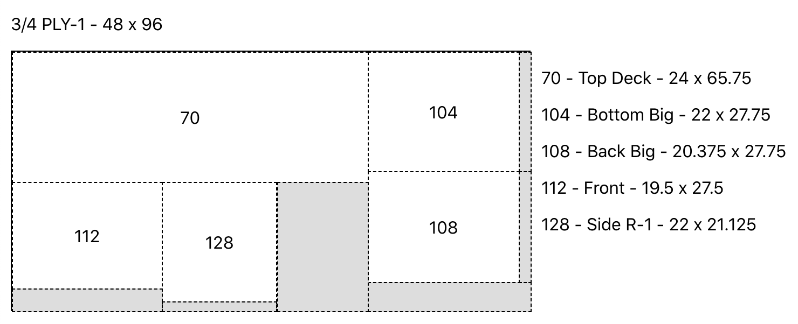

# sheet cutter

This is a tool to determine ideal cuts in sheet goods based on a cut list and available stock. Designed for woodworking projects but may be useful elsewhere.

Features:

- Import panel needs and inventory via CSV format
- Several options for laying out panels:
  - Least area - attempt to leave largest "waste" panels possible
  - Shortest cuts - minimize the number of long cuts (at the expense of greater waste)

Screenshot

